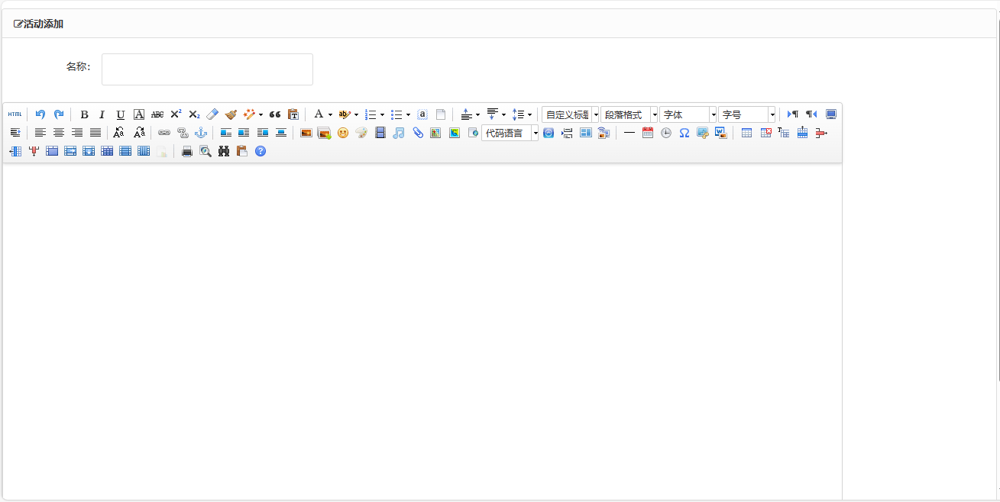

<h1 align="center">44.基于ssm的校园活动管理</h1>

 获取sql文件 QQ: 386869957 QQ群: 377586148 

 [推荐站点: 从戎源码网](https://armycodes.com/) 

## 简介

> 本代码来源于网络,仅供学习参考使用!
> 
> 用户端访问地址：http://localhost:8080/ssm_xymh_sys/login/index.do
> 
> 用户名密码：lpl 123
> 
> 管理后台：http://localhost:8080/ssm_xymh_sys/login/toLogin.do
> 
> 管理员：admin 123456
> 教师：teacher 123456
> 社团：st2 123456
>

## 项目介绍
基于ssm的校园活动管理：前端jsp、jquery、bootstrap，后端 spring、mybatis，集成活动管理、公告管理、新闻管理、校园风采、活动发布、校历管理、学科资源管理等功能于一体的系统。

## 功能介绍

### 用户

- 基本功能：登录、注册、退出、我的关注
- 首页：新闻快讯、通知公告、活动列表、轮播图、校历
- 详情页：快讯详情、公告详情、活动详情、学科资源详情
- 活动：发布活动、我参加的活动列表

### 管理端

- 角色管理：角色列表、添加角色、角色修改、角色删除、分配权限
- 权限管理：权限列表、权限编辑、权限删除、添加权限
- 社团管理：社团列表、添加社团、社团修改、角色分配、社团删除
- 老师管理：老师列表、关键词搜索、添加老师、修改老师、分配角色、老师删除
- 用户管理：用户列表、名称搜索、用户添加、用户修改、用户删除、分配角色
- 公告管理：公告列表、添加公告、修改公告、删除公告
- 新闻管理：新闻列表、添加新闻、修改新闻、删除新闻
- 校园风采管理：添加校园风采、修改校园风采、删除校园风采
- 活动发布管理：活动发布列表、发布活动、活动名单、修改活动、删除活动
- 校历管理：添加校历、校历列表、修改校历、删除校历
- 学科资源管理：添加学科资源、学科资源列表、修改学科资源、删除学科资源

## 环境

- <b>IntelliJ IDEA</b>

- <b>Mysql 5.7</b>

- <b>JDK 1.8</b>

## 运行截图

